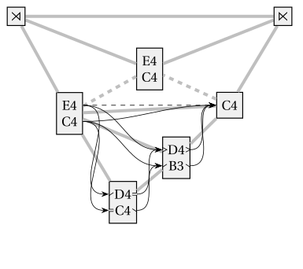
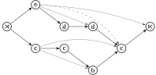

# Protovoices - A Model of Tonal Structure

 

This project is an implementation of the protovoice model as described in:

Finkensiep, Christoph, and Martin Rohrmeier. 2021. “Modeling and Inferring Proto-Voice Structure in Free Polyphony.”
In Proceedings of the 22nd International Society for Music Information Retreival Conference, 189–96. Online.
[](https://doi.org/10.5281/zenodo.5624431)

It provides types and functions for representing and working with protovoice derivations,
various parser implementations,
plotting functionality,
and a probabilistic model.

Have a look at the [documentation](https://dcmlab.github.io/protovoices-haskell/)

## Overview

### Library (`src/`)

The library part of the project (which implements the model) contains two types of modules,
generic modules, which work on generic "path grammars"
(with the common "outer operations" `split`, `spread`, and `freeze`)
and modules that are specific to the protovoice grammar.

- [Common](src/Common.hs)
  ([docs](https://dcmlab.github.io/protovoices-haskell/proto-voice-model-0.1.0.0/Common.html))
  Common types and functions for representing and working with generic "path grammars" and their derivations.
- [Display](src/Display.hs)
  ([docs](https://dcmlab.github.io/protovoices-haskell/proto-voice-model-0.1.0.0/Display.html))
  Generic code for plotting path grammar derivations.
- [ChartParser](src/ChartParser.hs)
  ([docs](https://dcmlab.github.io/protovoices-haskell/proto-voice-model-0.1.0.0/ChartParser.html))
  A semiring chart parser that exhaustively parses a path grammar.
  - [Scoring.FunTyped](src/Scoring/FunTyped.hs)
    ([docs](https://dcmlab.github.io/protovoices-haskell/proto-voice-model-0.1.0.0/Scoring-FunTyped.html))
    A representation of semiring scores with "holes" based on closures (used by the chart parser).
  - [Scoring.Deprecated.Flat](src/Scoring/Deprecated/Flat.hs)
    ([docs](https://dcmlab.github.io/protovoices-haskell/proto-voice-model-0.1.0.0/Scoring-Deprecated-Flat.html))
    Partial semiring scores based on lists (previously used by the chart parser).
- [GreedyParser](src/GreedyParser.hs)
  ([docs](https://dcmlab.github.io/protovoices-haskell/proto-voice-model-0.1.0.0/GreedyParser.html))
  A greedy parser that tries to find a single parse for a path grammar
  by choosing the next reduction step according to a policy (e.g., randomly).
- [PVGrammar](src/PVGrammar.hs)
  ([docs](https://dcmlab.github.io/protovoices-haskell/proto-voice-model-0.1.0.0/PVGrammar.html))
  Representing protovoice derivations and their operations.
  - [PVGrammar.Parse](src/PVGrammar/Parse.hs)
    ([docs](https://dcmlab.github.io/protovoices-haskell/proto-voice-model-0.1.0.0/PVGrammar-Parse.html))
    The parsing direction of the PV grammar.
  - [PVGrammar.Generate](src/PVGrammar/Generate.hs)
    ([docs](https://dcmlab.github.io/protovoices-haskell/proto-voice-model-0.1.0.0/PVGrammar-Generate.html))
    The generative direction of the PV grammar.
  - [PVGrammar.Prob.Simple](src/PVGrammar/Prob/Simple.hs)
    ([docs](https://dcmlab.github.io/protovoices-haskell/proto-voice-model-0.1.0.0/PVGrammar-Prob-Simple.html))
    A probabilistic model of the PV grammar.

### Executables (`app/`)

- [MainISMIR](app/MainISMIR.hs)
  Code for the paper linked above.
- [MainLearning](app/MainLearning.hs)
  Code for a Bayesian inference experiment (part of my dissertation).
- [MainExamples](app/MainExamples.hs)
  Generates or demonstrates various examples.
- [MainParsing](app/MainParsing.hs)
  Testbed for parsing.

## Building and Running

You can build the project with stack using:

```shell
$ stack build
```

Run any of the executables using:

```shell
$ stack exec {ismir2021,learn,examples,parse}
```

To build the documentation, run:

```shell
$ stack haddock
```
